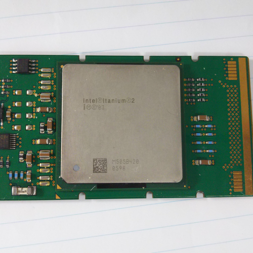
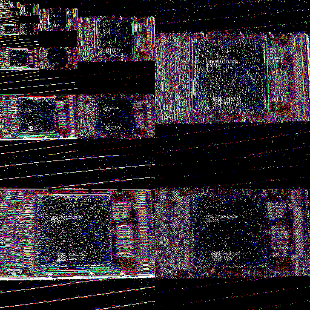

[Jananese](README_ja.md)/ English

# Example of Multiresolution Analysis using Haar Wavelet (2D)

## Usage

    $ ruby haar2d.rb

## Results

* input Data

* Transformed Data

* Inverse Transformed data

