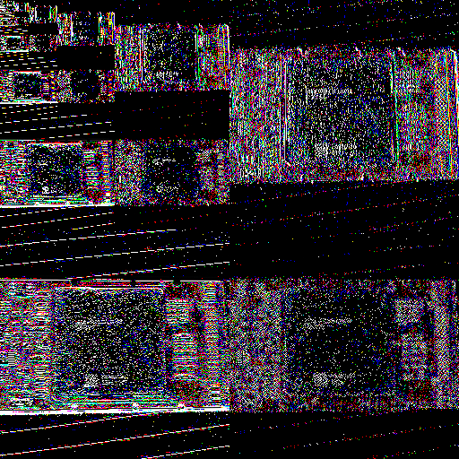
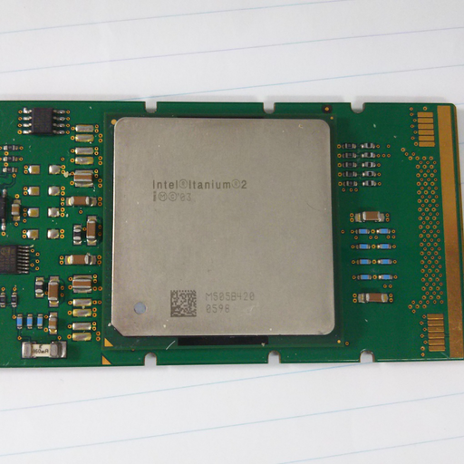

Japanese/ [English](README.md)

# ハールウェーブレットを用いた多重解像度解析のサンプル(2次元版)

## 概要

ハールウェーブレット(Haar Wavelet)を使って二次元画像の多重解像度解析をしてみる。

## Usage

    $ ruby haar2d.rb

## Results

* 入力データ

* 変換後のデータ

* 変換したデータを逆変換したデータ

